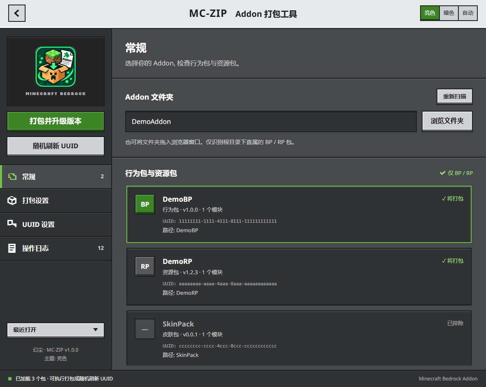

# MC-ZIP


Minecraft 基岩版 Addon 打包工具. 作者: 幻尘.

仅打包行为包 BP 和资源包 RP, 支持版本号递增、UUID 刷新及备份恢复.
默认界面按照 Bedrock Ore UI 的创建世界页面布局实现.



## 运行

双击 `dist-web/MC-ZIP-web.exe` 或原有快捷方式即可启动.
`dist/MC-ZIP.exe` 也使用同一套 Ore UI 界面.

源码运行需要 Python 3.8+ 与 Windows Edge:

```powershell
python mczip_web.py
```

也可双击 `启动(源码运行).bat` 或 `启动(网页界面).bat`.
将 Addon 文件夹拖到 exe 或启动脚本上, 会自动导入该目录.
`python addon_packer.py` 默认启动 Ore UI; `--tkinter` 可打开旧界面.

程序在 `127.0.0.1` 的临时端口提供界面, 使用 Edge 应用窗口承载.
Python 负责本地文件操作, 不需要前端构建工具或联网加载资源.
如已安装 pywebview, 可使用 `--pywebview` 启动 WebView2 窗口.
`--no-window` 仅启动本地服务, 会打印界面地址.

## 使用

- 常规: 浏览 Addon 文件夹, 检查包列表, 设置启动时打开上次项目.
- 打包设置: 选择输出格式、版本递增位、模块版本、备份与输出目录.
- UUID 设置: 选择 UUID 格式及是否同步刷新模块 UUID.
- 操作日志: 查看改动、输出文件和错误.

左侧按钮执行打包或刷新 UUID. 关闭版本升级开关后按钮变为
“打包 Addon”, 此时不会写回 manifest.
包列表中的非 BP/RP 包标记为“已排除”. 双击包或按 Enter 查看 manifest.
最近打开的项目、各项目的输出目录与选项会自动保存.
本地服务模式下, 可在路径输入框输入目录后按 Enter 导入.

## 打包范围

范围始终固定为 BP/RP. 旧配置的 `only_bp_rp: false` 会自动迁移,
直接传入该选项也不能关闭限制. 直接导入皮肤包或世界模板同样会拒绝打包.

包类型依据 `manifest.json` 的 `modules[*].type` 判断,
不要求文件夹必须命名为 BP 或 RP:

| 类型 | 模块类型 | 打包 |
| --- | --- | --- |
| 行为包 | `data`, `script`, `javascript` | 是 |
| 资源包 | `resources`, `client_data`, `interface` | 是 |
| 其他包 | 如 `skin_pack`, `world_template` | 否 |

所选目录自身有 manifest 时按单包处理. 否则仅检查直属子目录中的 manifest.
根目录的散落文件、docs、tools、截图以及这些目录里的嵌套示例包不会进入产物.

例如:

```text
MyAddon/
├── BP/manifest.json         打包
├── RP/manifest.json         打包
├── Skin/manifest.json       排除
├── docs/ExampleBP/          排除
├── tools/                   排除
└── readme.txt               排除
```

包内部保留实际资源, 自动忽略隐藏目录、版本控制目录、缓存、备份与临时文件.
本地后端也会跳过符号链接及越出包目录的文件引用.

## 输出格式

| 格式 | 结构 |
| --- | --- |
| 自动 | 直接导入单包生成 mcpack, 导入 Addon 生成 mcaddon |
| mcaddon | 各 BP/RP 目录并列放在压缩包根部 |
| mcpack | 每个 BP/RP 分别输出, manifest 位于各压缩包根部 |
| zip | 单包直接铺在根部, 多包按 BP/RP 目录并列 |

文件名包含最高版本号, 如 `MyAddon_v1.3.0.mcaddon`.
版本递增规则: 补丁位 `[1,4,7]` → `[1,4,8]`,
次版本 → `[1,5,0]`, 主版本 → `[2,0,0]`.

## 文件修改与配置

- manifest 修改前可备份为 `manifest.json.bak`, 随后使用原子写入.
- 保留键顺序、缩进、BOM 与末尾换行; 中文保持可读.
- UUID 操作刷新 header 与可选的 modules; dependencies 中的 UUID 保留.
- Python 和浏览器模式共享相同的 BP/RP 过滤与输出结构规则.

配置优先写到 exe 同目录的 `config.json`, 不可写时使用
`%APPDATA%/MC-ZIP/config.json`. 测试可通过 `MC_ZIP_CONFIG` 指定隔离配置.
浏览器独立模式将选项存入 localStorage, 目录授权存入 IndexedDB.

## Ore UI 实现

界面参考 Mojang 官方创建世界截图, 使用灰色顶栏、左侧导航、
分隔设置区域、绿色主操作、直角描边、底部阴影与明确的开关状态.
亮色主题对应官方截图的浅灰顶栏、深灰内容区; 暗色主题是其深色扩展.

[参考来源、控件依据与授权](docs/oreui-reference.md)记录了官方资料和实现边界.

前端使用 HTML/CSS/JavaScript, 所有字体与配色文件均在本地.
Mojang 的公开 Ore UI 仓库提供 React Facet 底层基础,
没有公开完整的 Minecraft 视觉组件. 本项目复现其视觉与交互,
并未把第三方组件称为官方组件.

演示模式: 在本地界面地址后添加 `?demo=1`, 使用内存中的 DemoAddon.
演示模式下对 manifest 的改动只发生在内存中.

## 构建与验证

```powershell
python dev/selftest.py
node dev/selftest_web.js
python dev/selftest_http.py
python mczip_web.py --selftest
python dev/smoketest_gui.py
pwsh -File dev/verify_exe.ps1
```

网页后端自测建议使用独立的 `MC_ZIP_CONFIG`, 避免改变最近项目记录.
核心测试包含真实压缩包内容、BP/RP 强制过滤、根目录杂项排除、
嵌套示例包排除、单包结构、旧配置迁移及版本和 UUID 修改.
浏览器核心测试额外验证 ZIP CRC 与中文文件内容.

`build_exe_web.bat` 输出 `dist-web/MC-ZIP-web.exe`.
`build_exe.bat` 输出 `dist/MC-ZIP.exe`.
两个构建入口都打包完整的 Ore UI 前端与 Python 后端.

## 文件结构

```text
addon_core.py           Python 核心逻辑
addon_config.py         配置持久化
mczip_web.py            本地服务与 Ore UI 启动入口
addon_packer.py         默认转入 Ore UI, 保留 tkinter 兼容入口
frontend/index.html    侧栏、设置页与弹窗
frontend/css/oreui.css  Ore UI 配色、边框与控件
frontend/css/app.css    应用布局与窄屏适配
frontend/css/vendor/    OreUI 参考配色与 MIT 许可
frontend/js/core.js     浏览器打包核心
frontend/js/oreui.js    主题、开关、菜单、弹窗与滚动行为
frontend/js/app.js      后端桥接与应用操作
dev/                   核心与界面自测
docs/                  Logo 与 Ore UI 参考资料
```
